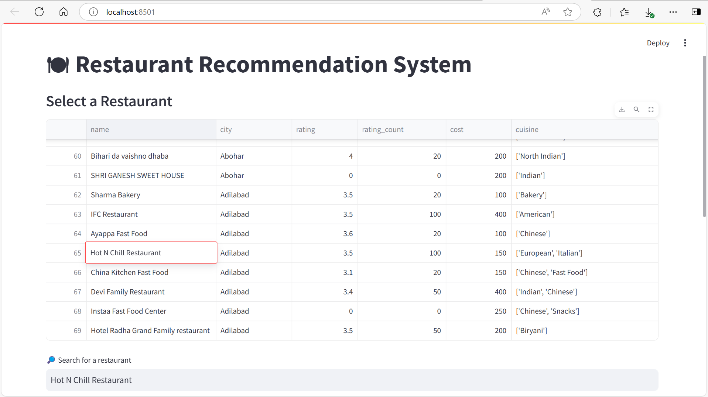

# Restaurant Recommendation System

## 📌 Overview
This is a **Restaurant Recommendation System** built using **Streamlit** and **Scikit-learn's Nearest Neighbors Algorithm**. The app suggests similar restaurants based on user selection, helping users explore new dining options effortlessly.

## 🚀 Features
- **Interactive UI with Streamlit**
- **Recommend Similar Restaurants Using Nearest Neighbors**
- **Memory Efficient with Sparse Matrices**
- **Full-Screen Layout for Better Usability**

## 🛠 Technologies Used
- **Python**
- **Pandas**
- **Scikit-learn (Nearest Neighbors)**
- **SciPy (Sparse Matrices)**
- **Streamlit (Web UI)**

## 📂 Project Structure
```
├── data
│   ├── cleaned_data.csv                             # Contains restaurant details cleaned by using 
│   ├── encoded_data.csv                             # Encoded features for similarity computation generated using 
│   ├── swiggy.csv                                   # Input data (Extract the data.7z file to get this file)
├── screenshots
│   ├── screenshot1.png                              # Example 1
│   ├── screenshot1.png                              # Example 2
├── restaurant_recommendation_app.py                 # Main application python file (takes cleaned_data.txt and encoded_data.txt as input)
├── clean_and_encode_swiggydata.ipynb                # Jupyter notebook file to generate cleaned_data.txt and encoded_data.txt from input data(swiggy.csv)
├── requirements.txt                                 # Required Python dependencies
├── README.md                                        # Project documentation
├── LICENSE                                          # MIT License
```

## ⚡ Installation & Setup
### 1️⃣ Clone the Repository
```bash
git clone https://github.com/santhanvasudevan/swiggy_restaurant_recommendation.git
cd swiggy_restaurant_recommendation
```

### 2️⃣ Install Dependencies
```bash
pip install -r requirements.txt
```

### 3️⃣ Run the Application
```bash
streamlit run restaurant_recommendation_app.py
```

## 📊 How It Works
1. **Load Data**: Reads restaurant details and encoded features.
2. **Search/Filter**: Users can search by restaurant name or apply filters.
3. **Select Restaurant**: Clicking on a restaurant triggers recommendations.
4. **Recommend Similar Restaurants**: Uses Nearest Neighbors to find similar options.

## 🔧 Configuration
Ensure the dataset files (`cleaned_data.csv` and `encoded_data.csv`) are available inside the `data` folder. Modify the file paths if needed.

## 📌 Example Screenshot
Example 1:


---
Example 2:


---

## 📜 License
This project is licensed under the MIT License.

## 🤝 Contributing
Feel free to submit issues or pull requests to improve the project!

---
🍽 Enjoy Your Restaurant Recommendations! 
